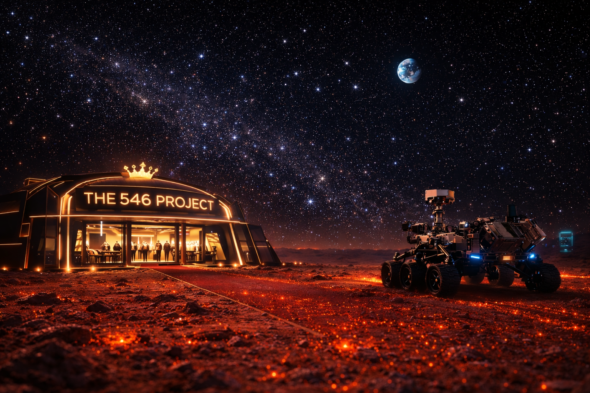

# 🔴 THE 546 PROJECT
> **MISSION STATUS: CONCEPTUAL DESIGN // NOT A COMMERCIAL ENTITY**

**[📡 LIVE DEMO UPLINK](https://the-546-project.vercel.app)**



## 📡 CONCEPTUAL OVERVIEW
**The 546 Project** is an immersive, fictionalized design concept and art project. It serves as a technical demonstration of high-end immersive UI/UX for a speculative future on Mars.

Designed for the first generation of Martian colonists in the year 2050, this platform explores the intersection of brutalist sci-fi aesthetics and advanced web technologies. 

> [!IMPORTANT]
> **This site is purely fictional.** Any products, services, or locations (e.g., Jezero Crater Sector 7) mentioned are part of an artistic narrative. No real financial transactions are conducted.

---

## 🛠 TECH STACK (THE SIMULATION ENGINE)
- **Frontend**: [Next.js 15+](https://nextjs.org/) (High-performance App Router)
- **3D Visualization**: [React Three Fiber](https://docs.pmnd.rs/react-three-fiber) & [Three.js](https://threejs.org/)
- **Motion Design**: [Framer Motion](https://www.framer.com/motion/) & [GSAP](https://greensock.com/gsap/)
- **Core Infrastructure**: [Supabase](https://supabase.com/) (Data & Auth Simulation)
- **Mock Payments**: [Razorpay](https://razorpay.com/) (Integrated in Test Mode/Conceptual Flow)
- **Atmospheric Audio**: Custom engine for procedural Mars-bound soundscapes

---

## 🚀 IMMERSIVE FEATURES
- **Orbital Holograms**: Interactive 3D planetary scanners and asset visualization.
- **Biometric Identity**: Mock authentication flow simulating Mars Colony security protocols.
- **Supply Chain Simulation**: Real-time distance telemetry and mock delivery logistics.
- **Brutalist UI**: Intricate HUD elements, scanlines, and CRT overlays for high-fidelity immersion.

---

## 📥 REQUISITION SETUP (FOR DEVELOPERS)

### 1. SYNCHRONIZE REPOSITORY
```bash
git clone https://github.com/your-username/the-546-project.git
cd the-546-project
```

### 2. INITIALIZE PROTOCOLS
```bash
npm install
```

### 3. CONFIGURE ENVIRONMENT
Rename `.env.example` to `.env.local` to connect the simulation to your own backend services (Supabase/Razorpay).

### 4. INITIATE UPLINK
```bash
npm run dev
```

---

## � DISCLAIMER & LICENSE
This is a non-commercial, conceptual art piece created for portfoilo and demonstration purposes.
Creative Commons Attribution-NonCommercial 4.0 International.

**"Adaptation is mandatory. The void is watching."**
